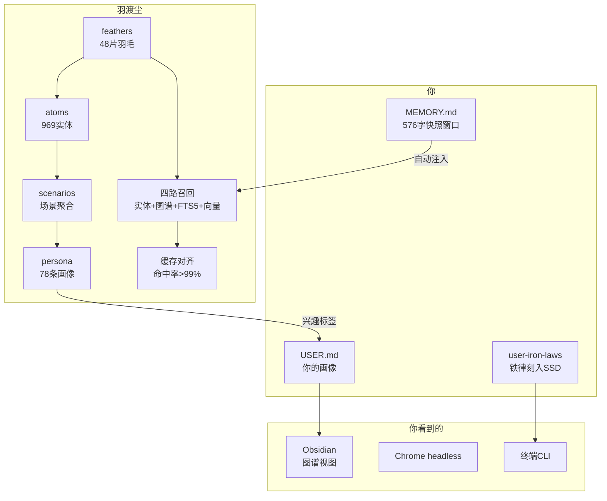

# 羽渡尘知识图谱

```mermaid
mindmap
  root((羽渡尘))
    分层记忆
      L0_羽毛
        47片Markdown
        YAML元数据
        Git版本控制
      L1_Atom
        969实体
        结构化事实
        溯源链
      L2_场景
        按标签聚合
        跨羽毛连接
      L3_画像
        78条事实
        自动兴趣提取
        高频话题排名
    检索管线
      四路召回
        实体匹配
        图谱关系
        FTS5全文
        向量语义
      动态TopK
        简单3条
        常规5条
        复杂8条
        调试12条
      缓存对齐
        核心兜_高频
        背景兜_低频
        字典序排序
        命中率99%
    存储系统
      MEMORY.md
        羽渡尘快照窗口
        576字动态生成
      USER.md
        你的画像
        扩容至5000字
      user-iron-laws
        铁律刻入SSD
        7个章节
      D盘羽毛库
        506GB空间
        iCloud教材链接
    工具生态
      Obsidian
        图谱视图
        [[Wikilink]]
        教材库联动
      Chrome
        headless爬虫
        端口9222
      VPS
        kejilion.sh
        翻墙通道
    你的方向
      EIE半导体
        模电_数电_计组
        C_C++_Linux
      槟城计划
        PSDC留学
        Intel_AMD
      大家伙
        EPYC_75F3
        RX_7900XTX
        CSE_846_4U
```



**这个脑图告诉你三件事：**

1. **羽渡尘**是你的记忆引擎——分层、检索、对齐
2. **你**是系统的核心——画像、铁律、快照窗口全围绕你
3. **你看到的**是三个入口——Obsidian 看图谱、Chrome 爬东西、终端干活
